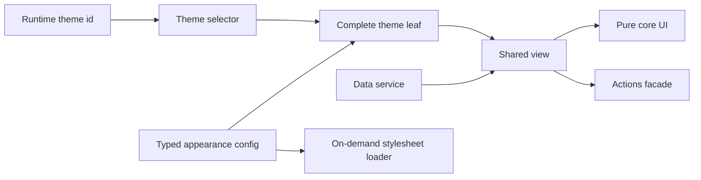

# Frontend Engineering Case Studies

[English](./README.md) · [繁體中文](./README.zh-TW.md) · [简体中文](./README.zh-CN.md) · [日本語](./README.ja.md) · [한국어](./README.ko.md) · [ไทย](./README.th.md)

匿名化された Angular/Nx アーキテクチャと Web パフォーマンスのケーススタディです。実行可能なデモと明確なエビデンス境界を含みます。

[Live Demo](https://stephen-taipei.github.io/frontend-engineering-case-studies/)

## 30–60 秒概要

- **課題:** 大規模フロントエンド基盤で 100+ のテーマと複数レイアウトを支えつつ、カスタマイズロジックが共有コンポーネントへ拡散しないようにする必要がありました。
- **アーキテクチャ:** Config-driven な `core / view / default / theme` ファミリーと明確な `facade / service` 境界により、各テーマを完全でテスト可能な leaf として構成します。
- **本番成果:** 代表的な完全 theme leaf を 23 行まで削減しました。さらに 136 個の theme stylesheet をオンデマンド読み込みへ変更し、1 テーマあたりのリクエスト量を約 2.4 MB から 17 KB へ、約 99% 削減しました。
- **公開検証:** 本リポジトリでは 3 つの架空テーマを使って同じアーキテクチャ機構を再実装しています。型付き契約、runtime 切り替え、ファミリー完全性テスト、オンデマンド CSS、CI を含みます。
- **境界:** 公開デモはオリジナルかつ合成データのみで構成され、本番ソース、会社名、業務ロジック、ドメイン、アセットを含みません。過去の bundle サイズ再現も主張しません。

## Demo の実行

[Hosted Demo](https://stephen-taipei.github.io/frontend-engineering-case-studies/) を開くか、ローカルで実行できます。

要件: Node.js 22.22.3+、24.15.0+ または 26+、pnpm 10+。

```sh
pnpm install --frozen-lockfile
pnpm nx serve theme-demo
```

`http://localhost:4200` を開き、架空の Default、Aurora、Summit テーマを切り替えます。

全 quality gate:

```sh
pnpm format:check
pnpm lint
pnpm test
pnpm build
```

## アーキテクチャ概要



意図的な境界設計:

- `core` は view-ready な必須入力のみを受け取り UI intent を出力します。routing、API DTO、theme identifier、brand asset は import しません。
- `view` は core、data service、actions facade を調整します。
- 各 theme leaf は完全な typed config を提供し、同じ shared view contract を使います。
- selector が family membership を明示します。宣言済みテーマに config、selector coverage、renderable leaf のいずれかが欠けると completeness test が失敗します。
- 単一 stylesheet loader が現在の theme `<link>` を管理し、未使用テーマの CSS を読み込みません。

## Case Studies

1. [Config-driven multi-theme architecture](docs/case-studies/config-driven-multi-theme.md)
2. [On-demand theme CSS and measured web performance](docs/case-studies/on-demand-theme-css.md)
3. [Evidence boundaries and claim audit](docs/evidence-boundaries.md)

## Repository map

```text
apps/theme-demo/
  public/themes/        Runtime で読み込む synthetic theme CSS
  src/app/              実行可能な demo shell
libs/theme-platform/
  src/lib/contracts/    Typed family contracts
  src/lib/core/         Pure shared UI
  src/lib/view/         Coordination layer
  src/lib/data/         Data service boundary
  src/lib/actions/      Actions facade boundary
  src/lib/themes/       Config、selector、leaves、CSS loader
docs/                   Case studies と evidence boundaries
```

## このリポジトリが示すもの

- Angular、TypeScript、Nx、Signals、`OnPush` の実践
- Config-driven component architecture と明確な dependency boundaries
- テスト可能な theme-family completeness
- 単一オンデマンド stylesheet による runtime theme switching
- 本番結果と公開デモの証明を分離する evidence-aware technical communication

## 主張しないこと

- 公開デモは private production codebase を再現しません。
- 3 つの小さな stylesheet は過去の 2.4 MB から 17 KB という測定値を再現しません。
- 23 行という値はリファクタ後の代表的な production theme leaf を指し、全ファイルではありません。
- 70 modules は migration scope であり performance result ではありません。
- Lighthouse の結果は実測した key pages にのみ適用されます。

## License

[MIT](LICENSE)
