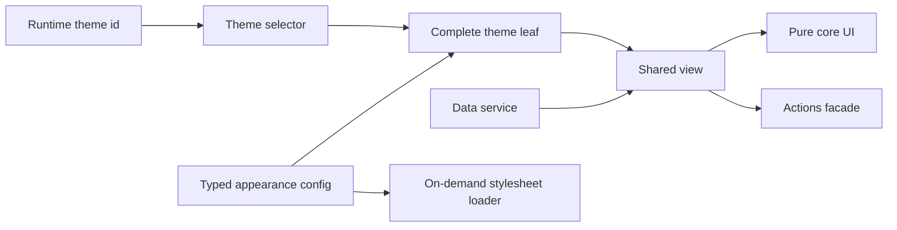

# Frontend Engineering Case Studies

[English](./README.md) · [繁體中文](./README.zh-TW.md) · [简体中文](./README.zh-CN.md) · [日本語](./README.ja.md) · [한국어](./README.ko.md) · [ไทย](./README.th.md)

식별 정보를 제거한 Angular/Nx 아키텍처 및 웹 성능 사례 연구입니다. 실행 가능한 데모와 명확한 evidence boundary를 포함합니다.

[Live Demo](https://stephen-taipei.github.io/frontend-engineering-case-studies/)

## 30–60초 요약

- **문제:** 대규모 프론트엔드 플랫폼에서 100+ 테마와 여러 레이아웃을 지원하면서 커스터마이징 로직이 공용 컴포넌트로 퍼지지 않도록 해야 했습니다.
- **아키텍처:** Config-driven `core / view / default / theme` 패밀리와 명확한 `facade / service` 경계를 사용해 각 테마를 완전하고 테스트 가능한 leaf로 구성합니다.
- **프로덕션 성과:** 대표적인 complete theme leaf를 23줄까지 줄였습니다. 별도로 136개의 theme stylesheet를 on-demand loading으로 전환해 한 테마의 요청량을 약 2.4 MB에서 17 KB로 줄였습니다. 약 99% 감소입니다.
- **공개 검증:** 이 저장소는 3개의 가상 테마로 같은 아키텍처 메커니즘을 재구현합니다. typed contracts, runtime switching, family-completeness tests, on-demand CSS, CI를 포함합니다.
- **경계:** 공개 데모는 독자적으로 만든 synthetic 구현입니다. 프로덕션 소스, 회사명, 비즈니스 로직, 도메인, 자산을 포함하지 않으며 과거 bundle size를 재현한다고 주장하지 않습니다.

## Demo 실행

[Hosted Demo](https://stephen-taipei.github.io/frontend-engineering-case-studies/)를 열거나 로컬에서 실행할 수 있습니다.

요구사항: Node.js 22.22.3+, 24.15.0+ 또는 26+, pnpm 10+.

```sh
pnpm install --frozen-lockfile
pnpm nx serve theme-demo
```

`http://localhost:4200`을 열고 가상의 Default, Aurora, Summit 테마를 전환할 수 있습니다.

모든 quality gate 실행:

```sh
pnpm format:check
pnpm lint
pnpm test
pnpm build
```

## 아키텍처 개요



의도적인 경계:

- `core`는 view-ready 필수 입력만 받고 UI intent를 내보냅니다. routing, API DTO, theme identifier, brand asset은 import하지 않습니다.
- `view`는 core, data service, actions facade를 조정합니다.
- 각 theme leaf는 완전한 typed config를 제공하고 동일한 shared view contract를 사용합니다.
- selector가 family membership을 명시합니다. 선언된 테마에서 config, selector coverage, renderable leaf가 빠지면 completeness test가 실패합니다.
- 하나의 stylesheet loader가 현재 theme `<link>`를 관리하므로 비활성 테마 CSS를 요청하지 않습니다.

## Case Studies

1. [Config-driven multi-theme architecture](docs/case-studies/config-driven-multi-theme.md)
2. [On-demand theme CSS and measured web performance](docs/case-studies/on-demand-theme-css.md)
3. [Evidence boundaries and claim audit](docs/evidence-boundaries.md)

## Repository map

```text
apps/theme-demo/
  public/themes/        Runtime에서 로드하는 synthetic theme CSS
  src/app/              실행 가능한 demo shell
libs/theme-platform/
  src/lib/contracts/    Typed family contracts
  src/lib/core/         Pure shared UI
  src/lib/view/         Coordination layer
  src/lib/data/         Data service boundary
  src/lib/actions/      Actions facade boundary
  src/lib/themes/       Config, selector, leaves, CSS loader
docs/                   Case studies 및 evidence boundaries
```

## 이 저장소가 보여주는 것

- Angular, TypeScript, Nx, Signals, `OnPush` 실전 경험
- Config-driven component architecture와 명확한 dependency boundaries
- 테스트 가능한 theme-family completeness
- 하나의 on-demand stylesheet를 사용한 runtime theme switching
- 프로덕션 결과와 공개 데모 증명을 분리하는 evidence-aware technical communication

## 주장하지 않는 것

- 공개 데모는 private production codebase를 재현하지 않습니다.
- 3개의 작은 stylesheet는 과거 2.4 MB에서 17 KB로 줄어든 측정값을 재현하지 않습니다.
- 23줄은 리팩터링 후 대표적인 production theme leaf를 의미하며 모든 파일을 뜻하지 않습니다.
- 70 modules는 migration scope이며 performance result가 아닙니다.
- Lighthouse 결과는 측정한 key pages에만 적용됩니다.

## License

[MIT](LICENSE)
