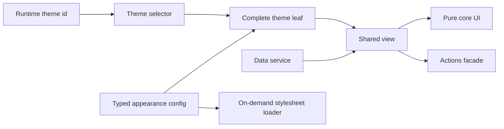

# Frontend Engineering Case Studies

Sanitized Angular/Nx architecture and web performance case studies with runnable demos and explicit evidence boundaries.

[繁體中文](docs/README.zh-TW.md)

## 30–60 second brief

- **Problem:** A large frontend platform had to support 100+ themes and multiple layouts without allowing customization logic to spread through shared components.
- **Architecture:** A config-driven `core / view / default / theme` family with explicit `facade / service` boundaries turns each theme into a complete, testable leaf.
- **Production outcomes:** A representative complete theme leaf was reduced to 23 lines. Separately, 136 theme stylesheets were changed to on-demand loading, reducing one theme request from about 2.4 MB to 17 KB (about 99%).
- **Public proof:** This repository reimplements the architectural mechanism with three fictional themes. It includes typed contracts, runtime switching, family-completeness tests, on-demand CSS, and CI.
- **Boundary:** The public demo is original and synthetic. It contains no production source, company names, business logic, domains, or assets, and it does not claim to reproduce the historical bundle sizes.

## Run the demo

Requirements: Node.js 22+ and pnpm 10+.

```sh
pnpm install --frozen-lockfile
pnpm nx serve theme-demo
```

Open `http://localhost:4200` and switch among the fictional Default, Aurora, and Summit themes.

Run all quality gates:

```sh
pnpm format:check
pnpm lint
pnpm test
pnpm build
```

## Architecture at a glance



The boundaries are deliberate:

- `core` accepts required, view-ready inputs and emits UI intents. It does not import routing, API DTOs, theme identifiers, or brand assets.
- `view` coordinates the core with a data service and actions facade.
- every theme leaf provides a complete typed config and uses the same shared view contract;
- a selector makes family membership explicit; completeness tests fail if a declared theme is missing config, selector coverage, or a renderable leaf;
- one stylesheet loader owns the active theme `<link>`, so inactive theme CSS is not requested.

## Case studies

1. [Config-driven multi-theme architecture](docs/case-studies/config-driven-multi-theme.md)
2. [On-demand theme CSS and measured web performance](docs/case-studies/on-demand-theme-css.md)
3. [Evidence boundaries and claim audit](docs/evidence-boundaries.md)

## Repository map

```text
apps/theme-demo/
  public/themes/        Synthetic theme CSS loaded at runtime
  src/app/              Runnable demo shell
libs/theme-platform/
  src/lib/contracts/    Typed family contracts
  src/lib/core/         Pure shared UI
  src/lib/view/         Coordination layer
  src/lib/data/         Data service boundary
  src/lib/actions/      Actions facade boundary
  src/lib/themes/       Config, selector, leaves, and CSS loader
docs/                   Bilingual case studies and evidence boundaries
```

## What this demonstrates

- Hands-on Angular, TypeScript, Nx, Signals, and `OnPush`
- Config-driven component architecture and explicit dependency boundaries
- Testable theme-family completeness
- Runtime theme switching with one on-demand stylesheet
- Evidence-aware technical communication: production results and public-demo proof are kept separate

## What is not claimed

- The public demo does not reproduce a private production codebase.
- Its three small stylesheets do not reproduce the historical 2.4 MB to 17 KB measurement.
- The 23-line figure refers to a representative production theme leaf after the refactor, not every file in the system.
- The 70-module figure is migration scope, not a performance result.
- The Lighthouse result applies to measured key pages, not every page or every Lighthouse category.

## License

[MIT](LICENSE)
