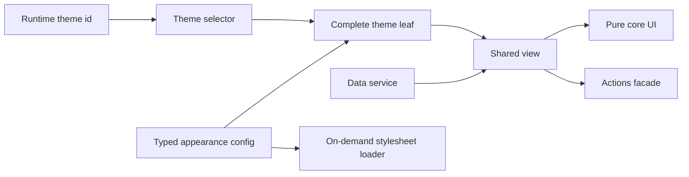

# Frontend Engineering Case Studies

[English](./README.md) · [繁體中文](./README.zh-TW.md) · [简体中文](./README.zh-CN.md) · [日本語](./README.ja.md) · [한국어](./README.ko.md) · [ไทย](./README.th.md)

กรณีศึกษา Angular/Nx architecture และประสิทธิภาพเว็บที่ผ่านการลบข้อมูลระบุตัวตนแล้ว พร้อมเดโมที่รันได้จริงและขอบเขตของหลักฐานที่ระบุชัดเจน

[Live Demo](https://stephen-taipei.github.io/frontend-engineering-case-studies/)

## สรุปภายใน 30–60 วินาที

- **ปัญหา:** แพลตฟอร์ม frontend ขนาดใหญ่ต้องรองรับธีมมากกว่า 100 แบบและหลาย layout โดยไม่ปล่อยให้ logic การปรับแต่งกระจายเข้าไปใน shared components
- **Architecture:** ใช้ตระกูลแบบ config-driven `core / view / default / theme` พร้อม boundary ของ `facade / service` ที่ชัดเจน ทำให้แต่ละธีมเป็น leaf ที่สมบูรณ์และทดสอบได้
- **ผลลัพธ์ใน production:** complete theme leaf ที่เป็นตัวแทนถูกลดเหลือ 23 บรรทัด นอกจากนี้ stylesheet ของ 136 ธีมถูกเปลี่ยนเป็น on-demand loading ทำให้ request ของหนึ่งธีมลดจากประมาณ 2.4 MB เหลือ 17 KB หรือประมาณ 99%
- **หลักฐานสาธารณะ:** repo นี้สร้างกลไก architecture เดิมขึ้นใหม่ด้วยธีมสมมติ 3 แบบ พร้อม typed contracts, runtime switching, family-completeness tests, on-demand CSS และ CI
- **ขอบเขต:** public demo เป็นงานที่สร้างใหม่และใช้ข้อมูล synthetic ไม่มี production source, ชื่อบริษัท, business logic, domain หรือ asset จริง และไม่ได้อ้างว่าสามารถจำลอง bundle size ในอดีตได้

## รัน Demo

เปิด [Hosted Demo](https://stephen-taipei.github.io/frontend-engineering-case-studies/) หรือรันในเครื่องได้

ข้อกำหนด: Node.js 22.22.3+, 24.15.0+ หรือ 26+ และ pnpm 10+

```sh
pnpm install --frozen-lockfile
pnpm nx serve theme-demo
```

เปิด `http://localhost:4200` แล้วสลับระหว่างธีมสมมติ Default, Aurora และ Summit

รัน quality gates ทั้งหมด:

```sh
pnpm format:check
pnpm lint
pnpm test
pnpm build
```

## Architecture โดยสรุป



Boundary ถูกออกแบบไว้อย่างชัดเจน:

- `core` รับเฉพาะ input ที่พร้อมสำหรับ view และปล่อย UI intent โดยไม่ import routing, API DTO, theme identifier หรือ brand assets
- `view` ประสาน core กับ data service และ actions facade
- แต่ละ theme leaf มี typed config ที่ครบถ้วนและใช้ shared view contract เดียวกัน
- selector ทำให้ family membership ชัดเจน หากธีมที่ประกาศไว้ขาด config, selector coverage หรือ renderable leaf การทดสอบ completeness จะ fail
- stylesheet loader เพียงตัวเดียวเป็นเจ้าของ theme `<link>` ที่ใช้งานอยู่ จึงไม่ request CSS ของธีมที่ไม่ได้เปิดใช้

## Case Studies

1. [Config-driven multi-theme architecture](docs/case-studies/config-driven-multi-theme.md)
2. [On-demand theme CSS and measured web performance](docs/case-studies/on-demand-theme-css.md)
3. [Evidence boundaries and claim audit](docs/evidence-boundaries.md)

## Repository map

```text
apps/theme-demo/
  public/themes/        Synthetic theme CSS ที่โหลดตอน runtime
  src/app/              Demo shell ที่รันได้จริง
libs/theme-platform/
  src/lib/contracts/    Typed family contracts
  src/lib/core/         Pure shared UI
  src/lib/view/         Coordination layer
  src/lib/data/         Data service boundary
  src/lib/actions/      Actions facade boundary
  src/lib/themes/       Config, selector, leaves และ CSS loader
docs/                   Case studies และ evidence boundaries
```

## สิ่งที่ repo นี้แสดงให้เห็น

- ประสบการณ์จริงกับ Angular, TypeScript, Nx, Signals และ `OnPush`
- Config-driven component architecture และ dependency boundaries ที่ชัดเจน
- Theme-family completeness ที่ทดสอบได้
- Runtime theme switching ด้วย on-demand stylesheet เพียงชุดเดียว
- การสื่อสารทางเทคนิคที่แยก production results ออกจาก public-demo proof อย่างชัดเจน

## สิ่งที่ไม่ได้อ้าง

- Public demo ไม่ได้จำลอง private production codebase
- Stylesheet ขนาดเล็ก 3 ชุดไม่ได้จำลองการวัดในอดีตจาก 2.4 MB เหลือ 17 KB
- ตัวเลข 23 บรรทัดหมายถึง production theme leaf ตัวอย่างหลัง refactor ไม่ใช่ทุกไฟล์ในระบบ
- ตัวเลข 70 modules หมายถึง migration scope ไม่ใช่ performance result
- ผล Lighthouse ใช้กับ key pages ที่วัดจริงเท่านั้น

## License

[MIT](LICENSE)
