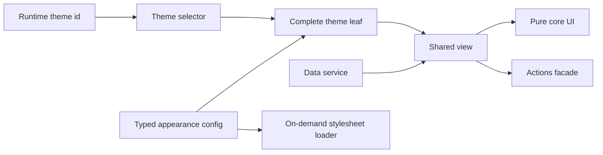

# Frontend Engineering Case Studies

[English](./README.md) · [繁體中文](./README.zh-TW.md) · [简体中文](./README.zh-CN.md) · [日本語](./README.ja.md) · [한국어](./README.ko.md) · [ไทย](./README.th.md)

经过脱敏处理的 Angular/Nx 架构与 Web 性能案例研究，包含可运行 Demo 和明确的证据边界。

[在线 Demo](https://stephen-taipei.github.io/frontend-engineering-case-studies/)

## 30–60 秒摘要

- **问题：** 大型前端平台需要支持 100+ 主题与多种布局，同时避免定制逻辑扩散到共享组件。
- **架构：** 采用配置驱动的 `core / view / default / theme` 家族，并通过明确的 `facade / service` 边界，让每个主题都成为完整、可测试的 leaf。
- **生产结果：** 一个具有代表性的完整 theme leaf 被压缩到 23 行。另将 136 份 theme stylesheet 改为按需加载，使单一主题请求量约从 2.4 MB 降到 17 KB，约 99%。
- **公开验证：** 本仓库使用三个虚构主题重新实现该架构机制，包含类型契约、runtime 切换、家族完整性测试、按需 CSS 和 CI。
- **边界：** 公开 Demo 为原创且合成，不包含生产源码、公司名称、业务逻辑、域名或资产，也不声称重现历史 bundle 大小。

## 运行 Demo

打开 [在线 Demo](https://stephen-taipei.github.io/frontend-engineering-case-studies/)，可独立切换语言与亮暗模式，也可在本地运行。

要求：Node.js 22.22.3+、24.15.0+ 或 26+，以及 pnpm 10+。

```sh
pnpm install --frozen-lockfile
pnpm nx serve theme-demo
```

打开 `http://localhost:4200`，可在虚构的 Default、Aurora 与 Summit 主题之间切换。

运行全部 quality gates：

```sh
pnpm format:check
pnpm lint
pnpm test
pnpm build
```

## 架构概览



这些边界是有意设计的：

- `core` 只接收已准备给 view 使用的必要输入并输出 UI intent，不导入 routing、API DTO、theme identifier 或品牌资产。
- `view` 负责协调 core、data service 和 actions facade。
- 每个 theme leaf 都提供完整 typed config，并共用相同的 view contract。
- selector 明确声明家族成员。若任何已声明主题缺少 config、selector coverage 或可渲染 leaf，完整性测试就会失败。
- 单一 stylesheet loader 持有当前激活的 theme `<link>`，因此不会请求未启用主题的 CSS。

## Case Studies

1. [Config-driven multi-theme architecture](docs/case-studies/config-driven-multi-theme.md)
2. [On-demand theme CSS and measured web performance](docs/case-studies/on-demand-theme-css.md)
3. [Evidence boundaries and claim audit](docs/evidence-boundaries.md)

## Repo 结构

```text
apps/theme-demo/
  public/themes/        Runtime 加载的合成 theme CSS
  src/app/              可运行 Demo shell
libs/theme-platform/
  src/lib/contracts/    Typed family contracts
  src/lib/core/         纯共享 UI
  src/lib/view/         Coordination layer
  src/lib/data/         Data service boundary
  src/lib/actions/      Actions facade boundary
  src/lib/themes/       Config、selector、leaves 与 CSS loader
docs/                   Case studies 与 evidence boundaries
```

## 本项目展示内容

- Angular、TypeScript、Nx、Signals 与 `OnPush` 实作经验
- Config-driven component architecture 与明确 dependency boundaries
- 可测试的 theme-family completeness
- Runtime theme switching 与单一按需 stylesheet
- 使用证据边界区分生产结果与公开 Demo 证明

## 未声明事项

- 公开 Demo 不重现任何私有生产 codebase。
- 三份小型 stylesheet 不重现历史 2.4 MB 到 17 KB 的测量。
- 23 行指重构后具有代表性的生产 theme leaf，不代表系统中每个文件。
- 70 modules 指 migration scope，不是性能结果。
- Lighthouse 结果仅适用于实际测量的关键页面，不代表所有页面与所有 Lighthouse 类别。

## 许可

[MIT](LICENSE)
