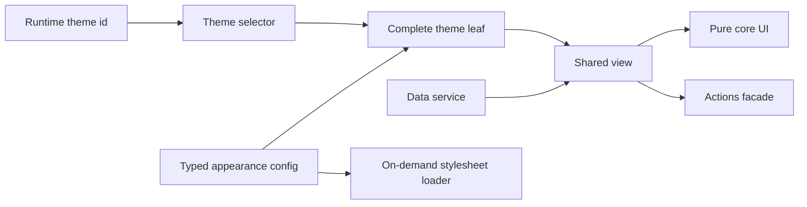

# Frontend Engineering Case Studies

[English](./README.md) · [繁體中文](./README.zh-TW.md) · [简体中文](./README.zh-CN.md) · [日本語](./README.ja.md) · [한국어](./README.ko.md) · [ไทย](./README.th.md)

經過去識別化處理的 Angular/Nx 架構與 Web 效能案例研究，包含可執行 Demo 與明確的證據邊界。

[線上 Demo](https://stephen-taipei.github.io/frontend-engineering-case-studies/)

## 30–60 秒摘要

- **問題：** 大型前端平台需支援 100+ 主題與多種版型，同時避免客製化邏輯滲入共用元件。
- **架構：** 以設定驅動的 `core / view / default / theme` 家族，加上明確的 `facade / service` 邊界，讓每個主題都成為完整、可測試的 leaf。
- **正式環境成果：** 一個具代表性的完整 theme leaf 壓縮至 23 行。另將 136 份 theme stylesheet 改為按需載入，使單一主題請求量約由 2.4 MB 降至 17 KB，約 99%。
- **公開驗證：** 本 repo 以三個虛構主題重新實作該架構機制，包含型別契約、runtime 切換、家族完整性測試、按需 CSS 與 CI。
- **邊界：** 公開 Demo 為原創且合成，不含正式環境原始碼、公司名稱、商業邏輯、網域或資產，也不宣稱重現歷史 bundle 大小。

## 執行 Demo

開啟 [線上 Demo](https://stephen-taipei.github.io/frontend-engineering-case-studies/)，可獨立切換語言與亮暗模式，也可本機執行。

需求：Node.js 22.22.3+、24.15.0+ 或 26+，以及 pnpm 10+。

```sh
pnpm install --frozen-lockfile
pnpm nx serve theme-demo
```

開啟 `http://localhost:4200`，可在虛構的 Default、Aurora、Summit 主題間切換。

執行全部 quality gates：

```sh
pnpm format:check
pnpm lint
pnpm test
pnpm build
```

## 架構概覽



這些邊界是刻意設計的：

- `core` 只接受已準備好給 view 使用的必要輸入並輸出 UI intent，不匯入 routing、API DTO、theme identifier 或品牌資產。
- `view` 負責協調 core、data service 與 actions facade。
- 每個 theme leaf 都提供完整 typed config，並共用相同 view contract。
- selector 明確宣告家族成員。若任何已宣告主題缺少 config、selector coverage 或可渲染 leaf，完整性測試會失敗。
- 單一 stylesheet loader 擁有目前啟用中的 theme `<link>`，因此不會請求未啟用主題的 CSS。

## Case Studies

1. [Config-driven multi-theme architecture](docs/case-studies/config-driven-multi-theme.md)
2. [On-demand theme CSS and measured web performance](docs/case-studies/on-demand-theme-css.md)
3. [Evidence boundaries and claim audit](docs/evidence-boundaries.md)

## Repo 結構

```text
apps/theme-demo/
  public/themes/        Runtime 載入的合成 theme CSS
  src/app/              可執行 Demo shell
libs/theme-platform/
  src/lib/contracts/    Typed family contracts
  src/lib/core/         純共用 UI
  src/lib/view/         Coordination layer
  src/lib/data/         Data service boundary
  src/lib/actions/      Actions facade boundary
  src/lib/themes/       Config、selector、leaves 與 CSS loader
docs/                   Case studies 與 evidence boundaries
```

## 本專案展示內容

- Angular、TypeScript、Nx、Signals 與 `OnPush` 實作經驗
- Config-driven component architecture 與明確 dependency boundaries
- 可測試的 theme-family completeness
- Runtime theme switching 與單一按需 stylesheet
- 以證據邊界區隔正式環境成果與公開 Demo 證明

## 未宣稱事項

- 公開 Demo 不重現任何私人正式環境 codebase。
- 三份小型 stylesheet 不重現歷史 2.4 MB 到 17 KB 的量測。
- 23 行是重構後具代表性的正式環境 theme leaf，不代表系統內每個檔案。
- 70 modules 指 migration scope，不是效能結果。
- Lighthouse 成果僅適用於實際量測的關鍵頁面，不代表所有頁面與所有 Lighthouse 類別。

## 授權

[MIT](LICENSE)
