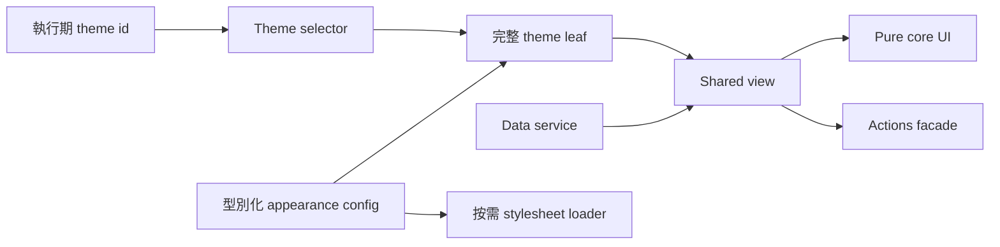

# 前端工程案例

以可執行 Demo 呈現去識別化的 Angular／Nx 架構與 Web 效能案例，並明確揭露證據與宣稱邊界。

[線上 Demo](https://stephen-taipei.github.io/frontend-engineering-case-studies/) · [English](../README.md)

## 30–60 秒摘要

- **問題：** 大型前端平台需支援 100+ 主題與多版型，且客製邏輯不能持續滲入共用元件。
- **架構：** 以 Config 驅動的 `core / view / default / theme` family，搭配明確的 `facade / service` 邊界，讓每個主題成為完整且可測試的 leaf。
- **Production 成果：** 一個具代表性的完整主題 leaf 精簡至 23 行。另一項效能改造則將 136 份主題 CSS 改為按需載入，使單次主題資源由約 2.4 MB 降至 17 KB，約降低 99%。
- **公開證明：** 本 repository 以三個虛構主題重新實作架構機制，包含型別契約、執行期切換、family-completeness 測試、CSS 按需載入與 CI。
- **邊界：** 公開 Demo 為原創的 synthetic implementation，不含 production 原始碼、公司名稱、商業邏輯、網域或素材，也不宣稱重現歷史 bundle 大小。

## 執行 Demo

直接開啟[線上 Demo](https://stephen-taipei.github.io/frontend-engineering-case-studies/)，切換英文／繁體中文，或在本機執行：

需求：Node.js 22.22.3+、24.15.0+ 或 26+，以及 pnpm 10+。

```sh
pnpm install --frozen-lockfile
pnpm nx serve theme-demo
```

開啟 `http://localhost:4200`，即可切換虛構的 Default、Aurora 與 Summit 主題。

執行所有品質閘門：

```sh
pnpm format:check
pnpm lint
pnpm test
pnpm build
```

## 架構速覽



各層邊界刻意保持清楚：

- `core` 僅接受必要且可直接渲染的 input，並輸出 UI intent；不 import routing、API DTO、theme identifier 或品牌素材。
- `view` 負責串接 core、data service 與 actions facade。
- 每個 theme leaf 提供完整的 typed config，並遵循相同 shared view contract。
- selector 明確列出 family 成員；若任一 theme 缺少 config、selector coverage 或可渲染 leaf，completeness 測試會失敗。
- stylesheet loader 單一管理目前啟用的 theme `<link>`，避免下載未使用的主題 CSS。

## 案例文件

1. [Config 驅動的多主題架構](case-studies/config-driven-multi-theme.zh-TW.md)
2. [主題 CSS 按需載入與 Web 效能實測](case-studies/on-demand-theme-css.zh-TW.md)
3. [證據邊界與宣稱稽核](evidence-boundaries.zh-TW.md)

## Repository 結構

```text
apps/theme-demo/
  public/themes/        執行期載入的 synthetic theme CSS
  src/app/              可執行 Demo shell
libs/theme-platform/
  src/lib/contracts/    型別化 family contracts
  src/lib/core/         Pure shared UI
  src/lib/view/         協調層
  src/lib/data/         Data service 邊界
  src/lib/actions/      Actions facade 邊界
  src/lib/themes/       Config、selector、leaves 與 CSS loader
docs/                   雙語案例與證據邊界
```

## 本案例能證明

- Angular、TypeScript、Nx、Signals 與 `OnPush` 的 hands-on 能力
- Config 驅動元件架構與清楚的相依邊界
- 可測試的 theme-family completeness
- 執行期主題切換與單一 CSS 按需載入
- 將 production 成果與公開 Demo 證明分開陳述的 evidence-aware 技術溝通

## 不宣稱的內容

- 公開 Demo 並非私人 production codebase 的複製品。
- 三份小型 CSS 不重現歷史上的 2.4 MB → 17 KB 實測。
- 23 行是重構後具代表性的 production 主題 leaf，不代表系統內每個檔案。
- 70 個模組是 migration scope，不是效能成果。
- Lighthouse 結果適用於關鍵實測頁面，不代表所有頁面或所有分類都有相同分數。

## 授權

[MIT](../LICENSE)
