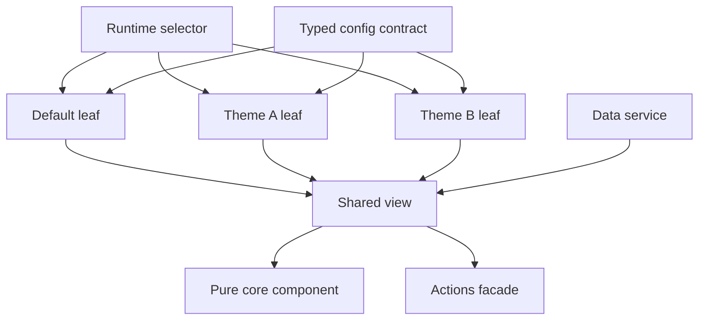

# Case study: Config-driven multi-theme architecture

[繁體中文](config-driven-multi-theme.zh-TW.md)

## 30-second summary

I designed and led a multi-theme architecture for a large Nx/Angular frontend platform supporting 100+ themes and multiple layouts. The refactor separated stable rendering, orchestration, data access, actions, and theme appearance. A representative complete production theme leaf was reduced to 23 lines; the wider migration introduced 70 purpose-specific architecture modules.

This repository proves the mechanism with original code and three fictional themes. It does not publish or recreate the production system.

## Problem

Theme-specific conditions had become interleaved with shared rendering, data access, navigation, and behavior. Each new customization increased the chance of sibling-theme drift, repeated code, and regression risk.

The architectural question was not merely how to apply different colors. It was how to keep a large customization family complete while allowing visual and product variation.

## My role

- Defined the target architecture and dependency rules.
- Designed the `core / view / default / theme` family and `facade / service` boundaries.
- Led the migration sequence and review criteria.
- Established completeness tests and shared contracts.
- Reviewed implementation quality and rollout risk.

## Design



### Core

The core component receives required, view-ready inputs and emits intents. It owns stable DOM and interaction semantics, but not routing, API payloads, theme selection, or brand assets.

### View

The view coordinates data and behavior. It maps the data service into core inputs and sends core intents to the actions facade.

### Theme leaf

Each leaf chooses one complete `ThemeAppearance` and reuses the shared view. In this synthetic example, [`ThemeAuroraComponent`](../../libs/theme-platform/src/lib/themes/theme-aurora.ts) contains no business conditionals.

### Typed configuration

[`THEME_APPEARANCES`](../../libs/theme-platform/src/lib/themes/theme-config.ts) uses:

```ts
satisfies Record<DemoTheme, ThemeAppearance>
```

This makes a missing or malformed theme configuration a compile-time failure.

### Family completeness

Tests enumerate every declared theme and verify:

- a complete config exists;
- the stylesheet path follows the family contract;
- the selector renders the corresponding leaf;
- each leaf reaches the same shared view/core boundary.

## Before and after

| Dimension                      | Before                                        | After                                                     |
| ------------------------------ | --------------------------------------------- | --------------------------------------------------------- |
| Customization model            | Distributed conditions and overrides          | One complete typed config per theme leaf                  |
| Shared rendering               | Mixed with theme and orchestration concerns   | Pure core with required inputs and output intents         |
| Data and actions               | Coupled to visual components                  | Data service and actions facade boundaries                |
| Family safety                  | Sibling completeness relied heavily on review | Compile-time config coverage plus runtime rendering tests |
| Representative production leaf | Hundreds of lines in the legacy path          | 23 lines after the refactor                               |

## Measured production result

- **Scope:** Nx/Angular frontend platform with 100+ themes and multiple layouts.
- **Role:** Architecture owner and migration lead.
- **Baseline:** Custom logic was distributed across large theme-specific implementations.
- **Result:** A representative complete production theme leaf was reduced to 23 lines.
- **Migration scope:** 70 new purpose-specific modules: 24 facades, 10 data services, 10 theme configs, and 26 shared views.
- **Not claimed:** 70 modules is a rollout-scope count, not a performance or code-reduction outcome. The 23-line result does not describe every leaf or every file.

## Trade-offs

- Explicit leaves create more small files, but make ownership and completeness visible.
- Config can simplify appearance and bounded variation; it should not become a generic language for arbitrary business logic.
- Shared core changes require stronger contract tests because their blast radius is wider.
- Runtime CSS switching needs a single owner to avoid stale stylesheets and race conditions.

## Public-demo boundary

The public code uses different names, content, styling, and implementation details. It demonstrates the design constraints without disclosing production source, product rules, domains, or assets. See the full [evidence-boundary audit](../evidence-boundaries.md).
