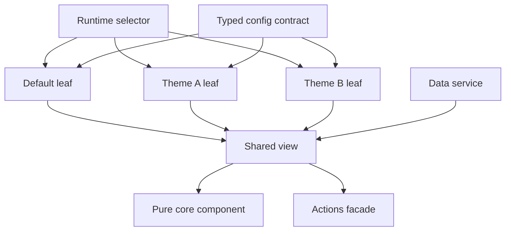

# 案例：Config 驅動的多主題架構

[English](config-driven-multi-theme.md)

## 30 秒摘要

我為支援 100+ 主題與多版型的大型 Nx／Angular 前端平台，制定並主導多主題統一架構。重構將穩定渲染、協調、資料存取、操作與主題外觀分層；具代表性的完整 production 主題 leaf 精簡至 23 行，整體 migration 則導入 70 個職責明確的架構模組。

本 repository 以原創程式碼與三個虛構主題證明架構機制，不公開或重建 production 系統。

## 問題

主題條件原本與共用渲染、資料存取、導頁及行為交織。每增加一項客製需求，都會提高 sibling theme 不一致、重複程式與回歸風險。

因此架構要解決的不只是換色，而是如何在允許視覺與產品差異的同時，維持大型客製 family 的完整性。

## 我的角色

- 定義目標架構與相依規則。
- 設計 `core / view / default / theme` family 與 `facade / service` 邊界。
- 主導 migration 順序與 Code Review 標準。
- 建立 completeness tests 與共用 contracts。
- 審核實作品質與 rollout 風險。

## 設計



### Core

Core component 僅接收必要且可直接渲染的 inputs，並輸出 intents。它負責穩定 DOM 與互動語意，但不負責 routing、API payload、theme selection 或品牌素材。

### View

View 負責協調資料與行為：將 data service 轉換為 core inputs，並把 core intents 交由 actions facade 處理。

### Theme leaf

每個 leaf 選擇一份完整的 `ThemeAppearance`，並重用 shared view。Synthetic 範例中的 [`ThemeAuroraComponent`](../../libs/theme-platform/src/lib/themes/theme-aurora.ts) 不含商業條件。

### Typed configuration

[`THEME_APPEARANCES`](../../libs/theme-platform/src/lib/themes/theme-config.ts) 使用：

```ts
satisfies Record<DemoTheme, ThemeAppearance>
```

缺少或格式錯誤的主題設定會在編譯期失敗。

### Family completeness

測試會列舉每個已宣告 theme，確認：

- 存在完整 config；
- stylesheet path 符合 family contract；
- selector 能渲染對應 leaf；
- 每個 leaf 都會進入相同的 shared view／core 邊界。

## Before／after

| 面向                       | Before                            | After                                               |
| -------------------------- | --------------------------------- | --------------------------------------------------- |
| 客製模型                   | 分散的條件與 override             | 每個 theme leaf 一份完整 typed config               |
| 共用渲染                   | 混合 theme 與協調職責             | Pure core，只保留 required inputs 與 output intents |
| 資料與操作                 | 與視覺元件耦合                    | Data service 與 actions facade 邊界                 |
| Family 安全性              | Sibling 完整性高度仰賴人工 review | 編譯期 config coverage + runtime rendering tests    |
| 具代表性的 production leaf | Legacy path 數百行                | 重構後 23 行                                        |

## Production 實測成果

- **Scope：** 支援 100+ 主題與多版型的 Nx／Angular 前端平台。
- **Role：** 架構負責人與 migration lead。
- **Baseline：** 客製邏輯分散於大型 theme-specific implementations。
- **Result：** 一個具代表性的完整 production theme leaf 精簡至 23 行。
- **Migration scope：** 70 個新架構模組，包含 24 facades、10 data services、10 theme configs、26 shared views。
- **Not claimed：** 70 個模組是 rollout scope，不是效能或程式碼縮減成果；23 行也不代表所有 leaf 或所有檔案。

## Trade-offs

- 明確的 leaves 會增加小檔案數量，但能清楚呈現責任與完整性。
- Config 適合簡化外觀與有邊界的差異，不應演變成描述任意商業邏輯的通用語言。
- Shared core 的影響範圍較大，因此需要更強的 contract tests。
- Runtime CSS switching 需要單一 owner，避免 stylesheet 殘留與競態。

## 公開 Demo 邊界

公開程式使用不同的名稱、內容、樣式與實作細節，只證明設計限制，不揭露 production source、產品規則、網域或素材。完整說明請見[證據邊界稽核](../evidence-boundaries.zh-TW.md)。
