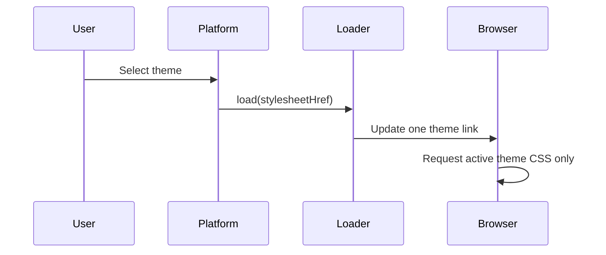

# Case study: On-demand theme CSS and measured web performance

[繁體中文](on-demand-theme-css.zh-TW.md)

## 30-second summary

I led a production refactor that stopped downloading 136 theme stylesheets up front. Loading only the active theme reduced one theme resource request from about 2.4 MB to 17 KB, a reduction of about 99%. In a broader quality initiative, key measured pages improved from Lighthouse Performance 50+ to 90+, while accessibility, best practices, and SEO also improved.

The public demo proves the loading mechanism with synthetic CSS. It does not reproduce the production payload sizes or Lighthouse environment.

## Problem

The browser paid the transfer and parsing cost for styles belonging to inactive themes. The architecture needed to preserve runtime theme switching without making every user download the entire theme catalog.

## My role

- Identified the theme-loading bottleneck and defined the target behavior.
- Led the architecture change from eager aggregation to one active stylesheet.
- Established validation for switching correctness and regression risk.
- Led broader Lighthouse-based performance and quality improvements on key pages.

## Public mechanism

Each complete theme config declares a stylesheet path. [`ThemeStylesheetLoader`](../../libs/theme-platform/src/lib/themes/theme-stylesheet.loader.ts) owns one stable `<link>` element:

The test suite verifies that repeated switches leave exactly one managed stylesheet active.

## Before and after

| Metric                                       |                     Before |                         After |               Change |
| -------------------------------------------- | -------------------------: | ----------------------------: | -------------------: |
| Theme CSS loading                            | 136 stylesheets aggregated | Active theme loaded on demand | Architectural change |
| Theme resource per request                   |               About 2.4 MB |                         17 KB |      About 99% lower |
| Lighthouse Performance on key measured pages |                        50+ |                           90+ |             Improved |

## Evidence boundary

- **Scope:** Historical production measurements from the refactored platform.
- **Role:** Frontend architecture and performance lead.
- **Baseline:** All theme CSS was included up front; key measured pages scored 50+ in Lighthouse Performance.
- **Result:** Active-theme CSS loading reduced the measured theme resource from about 2.4 MB to 17 KB; key measured pages reached 90+ Performance.
- **Additional improvements:** Accessibility, best practices, and SEO were improved during the quality initiative.
- **Not claimed:** The public synthetic CSS reproduces the historical byte measurement; all pages scored 90+; every Lighthouse category reached the same score; or CSS loading alone caused the full Lighthouse gain.

## Trade-offs and controls

- A runtime stylesheet request can reveal a flash or stale state if switching is not coordinated; one loader owns link replacement.
- Cache headers and stable asset names remain important even when only one theme is requested.
- CSS isolation must be checked across sibling themes, not only the currently edited theme.
- Performance evidence should record page, device profile, build, and test conditions instead of treating one score as universal.
