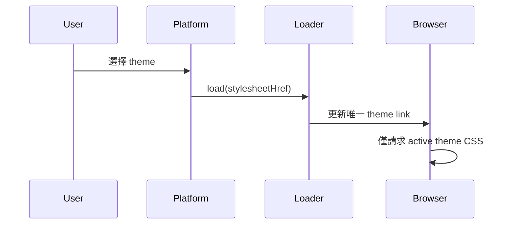

# 案例：主題 CSS 按需載入與 Web 效能實測

[English](on-demand-theme-css.md)

## 30 秒摘要

我主導 production 重構，停止預先下載 136 份主題 CSS，改為只載入目前使用的主題；單次主題資源由約 2.4 MB 降至 17 KB，約降低 99%。在更完整的網站品質專案中，關鍵實測頁面的 Lighthouse Performance 由 50+ 提升至 90+，accessibility、best practices 與 SEO 也同步改善。

公開 Demo 以 synthetic CSS 證明載入機制，不重現 production payload 大小或 Lighthouse 測試環境。

## 問題

瀏覽器原本必須負擔所有未啟用主題的傳輸與解析成本。架構需要保留執行期 theme switching，同時避免每位使用者下載完整的主題目錄。

## 我的角色

- 找出 theme loading bottleneck 並定義目標行為。
- 主導從 eager aggregation 改為單一 active stylesheet 的架構調整。
- 建立切換正確性與 regression risk 的 validation。
- 主導關鍵頁面的 Lighthouse 效能與品質改善。

## 公開機制

每份完整 theme config 都宣告 stylesheet path，[`ThemeStylesheetLoader`](../../libs/theme-platform/src/lib/themes/theme-stylesheet.loader.ts) 則單一管理固定的 `<link>`：

測試會確認反覆切換後仍只有一個受管理的 stylesheet。

## Before／after

| 指標                                |                 Before |                 After |       變化 |
| ----------------------------------- | ---------------------: | --------------------: | ---------: |
| Theme CSS 載入                      | 聚合 136 份 stylesheet | Active theme 按需載入 |   架構改造 |
| 單次主題資源                        |              約 2.4 MB |                 17 KB | 約降低 99% |
| 關鍵實測頁面 Lighthouse Performance |                    50+ |                   90+ |       提升 |

## 證據邊界

- **Scope：** 重構平台的歷史 production 實測。
- **Role：** 前端架構與效能負責人。
- **Baseline：** 所有 theme CSS 預先載入；關鍵實測頁面 Lighthouse Performance 為 50+。
- **Result：** Active-theme CSS loading 使實測主題資源由約 2.4 MB 降至 17 KB；關鍵實測頁面 Performance 達 90+。
- **Additional improvements：** 品質專案同步改善 accessibility、best practices 與 SEO。
- **Not claimed：** 公開 synthetic CSS 重現歷史位元組數；所有頁面皆達 90+；所有 Lighthouse 分類皆為相同分數；或完整 Lighthouse 提升只由 CSS 改造單獨造成。

## Trade-offs 與控制

- Runtime stylesheet request 若未協調，可能產生閃爍或殘留狀態，因此由單一 loader 管理 link replacement。
- 即使只載入一個 theme，cache headers 與穩定 asset naming 仍然重要。
- CSS isolation 必須跨 sibling themes 驗證，而非只檢查目前編輯的主題。
- 效能證據應記錄頁面、裝置設定、build 與測試條件，不應把單次分數視為普遍結果。
